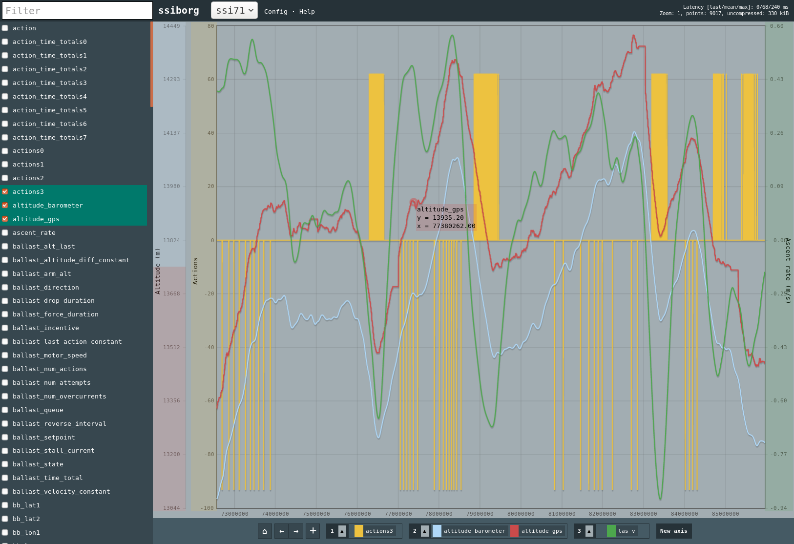

# Xandri

The ultimate goal is a more fully fledged database system, but for now this is merely a high performance server for dataframes of time series. While Matplotlib and friends are great for making pretty final plots, it takes a decent amount of setting up to quickly visualize and explore large datasets, especially when dealing with variables of different types with different scales, or millions of rows. This currently involves a command line interface for importing data, a server for it, and a web client for the actual plotting. However, a Python API for importing and plotting data is envisioned for the near future.

  

## Quick Start

### Requirements
You must have `screen` installed and an http server such as `apache2`. If using apache2, make sure the server is running with `sudo service apache2 start`

### Installation
After cloning, just run `make` from the top level. 

### Python interface
After getting it set up, run `make py`, and that should compile the Python library. You might need to have the usual python3-dev and what not installed. You should also put it in your `PYTHONPATH`: something like `export PYTHONPATH="/home/you/xandri/py_interface:$PYTHONPATH"` in your `.bashrc`. Then you can see a preliminary demo of how to go about using it at either `py_interface/newdemo.py` or `py_interface/test.py`.

## Client
Focus on having a reasonable network and memory footprint with fast plots and working well with multiple axes.
 - Support for arbitrarily many axes, each with independent scaling, position, and label.
 - Selecting plots via a sidebar with all the keys, moving plots between axes wtih drag and drop.
 - Highlighting of plots and their correseponding axes, color coded.
 - Navigation via rectangular selections and automatic scaling of the y axis.
    - Back and forward buttons with a cache for smoother transitions.
 - Switching between multiple dataframes.
The plotting uses the great [Flot](http://flotcharts.org/) library.

### Planned features
 - More autoscaling flexibility.
 - Arbitrary transforms, including shifts in axis.
 - Virtual columns evaluated via expressions of other columns.
 - Date support on legend.
 - I'm definitely forgetting stuff here.

## Backend
It provides both a command line interface for managing dataframes and a simple C server to host them.
 - Preprocessing of dataframe into multiple zoom levels (batched by mean) for quicker access later (coming soon: min/max reduction besides the mean to show the envelope as part of the downsampling).
 - The basic structure is:
    - Each dataframe has indices, which are timestamps at which points are defined. They can be uint{8,16,32,64}. The decision to not support float indices is deliberate, but also makes the code easier. In the future, floating point indices will be converted to fixed precision.
    - Each dataframe has keys, with hold the actual data. A key is associated with an index on which the points are defined (assumed sequential). This way the readings of multiple sensors (each with its own key) share an index representing the times when they were sampled. Keys can have type float{32,64} or int{8,16,32,64}. 
    - When storing indices and keys, optionally the data can be aggregated into summaries - for now, just the mean at different batch sizes, but soon also min/max. Zoom levels are picked automatically according to the length of the data.
 - The server is a raw C socket server that talks via HTTP, with deflate compression. Queries for information (such as available frames or keys of a frame) are returned via JSON; the actual data is returned in binary such that they can be read with, say, an ArrayBuffer/Float32Array on the JavaScript side, which is both way faster and has less overhead than JSON.
 - mmap used liberally.

### Planned features
 - Make it easier to import csv's/hdf5/etc.
 - Reduce min/max.
 - I'm definitely forgetting stuff here.

